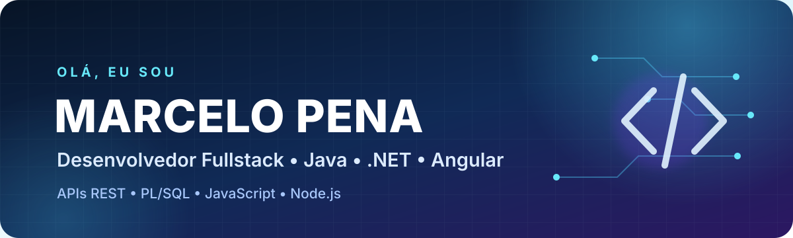

  

  
  
  

## Sobre mim

Olá! Sou Marcelo Pena, Desenvolvedor Back-end / Fullstack e formado em Ciência da Computação.

Tenho experiência com desenvolvimento e manutenção de sistemas, APIs REST, integrações e bancos de dados. Minha principal área de atuação envolve Java, C#/.NET, Angular, PL/SQL, JavaScript e Node.js. Também possuo conhecimentos em Delphi, C e C++.

Sou especialista em Cybersecurity e Inteligência Artificial na Prática, além de possuir MBA em Engenharia de Software. Quero unir minha experiência em desenvolvimento com segurança e Inteligência Artificial para criar soluções modernas, seguras e acessíveis.

Atualmente, estou aprimorando meus conhecimentos em Go, React, Python e Ruby.

Sou surdo e valorizo ambientes profissionais acessíveis, com comunicação clara, uso de texto, legendas e boa documentação.

## Tecnologias e ferramentas

### Stack profissional

**Principais especialidades:** PL/SQL, JavaScript, Node.js, Delphi, C e C++.

#### Back-end e APIs

  
  
  
  
  
  
  
  

#### Front-end

  
  
  

#### Bancos de dados

  
  
  
  

#### DevOps e ferramentas

  
  
  

### Tecnologias em estudo

Estou ampliando meus conhecimentos e buscando oportunidades que permitam desenvolver experiência prática nestas tecnologias:

  
  
  
  

## Projetos em destaque

| Projeto | Descrição | Tecnologias |
|---|---|---|
| [Clone Airbnb](https://github.com/marcelopena2010/clone-app-airbnb) | Aplicação fullstack de estudo inspirada em uma plataforma de hospedagens. | Angular 18, .NET 8, Entity Framework, SQL Server, Swagger |
| [Minhas Finanças API](https://github.com/marcelopena2010/minhasfinancas-api) | API para estudo de gerenciamento de finanças pessoais. | Java 11, Spring Boot, Spring Data JPA, PostgreSQL, MySQL, H2 |

> Os repositórios estão sendo revisados gradualmente para receber documentação, instruções de execução e uma apresentação mais clara.

## Formação e especializações

### Formação acadêmica

- Bacharelado em Ciência da Computação
- MBA em Engenharia de Software

### Especializações concluídas

  
  

- **Inteligência Artificial na Prática:** aplicação responsável de IA, automação e melhoria de processos.
- **Cybersecurity:** segurança de aplicações, proteção de dados e desenvolvimento seguro.

Busco aplicar esses conhecimentos no desenvolvimento de sistemas, APIs, integrações e soluções seguras apoiadas por Inteligência Artificial.

## Acessibilidade

Sou uma pessoa com deficiência auditiva. Valorizo ambientes inclusivos, comunicação por texto, legendas, documentação objetiva e recursos que tornem a tecnologia acessível para mais pessoas.

## Contribuições em modo arcade

  <picture>
    <source
      media="(prefers-color-scheme: dark)"
      srcset="https://raw.githubusercontent.com/marcelopena2010/marcelopena2010.github.io/output/pacman-contribution-graph-dark.svg"
    />
    <source
      media="(prefers-color-scheme: light)"
      srcset="https://raw.githubusercontent.com/marcelopena2010/marcelopena2010.github.io/output/pacman-contribution-graph.svg"
    />
    
  </picture>

  <strong>Vamos conversar?</strong> 
  Entre em contato comigo pelo <a href="https://www.linkedin.com/in/marcelopena2010/">LinkedIn</a>.

